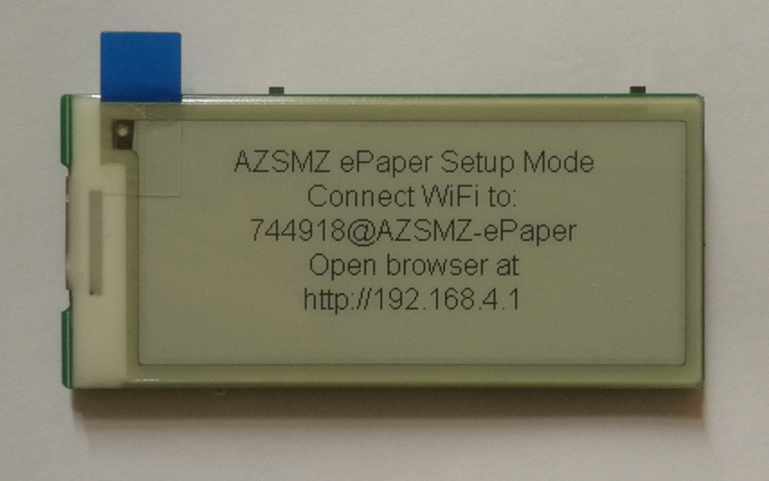
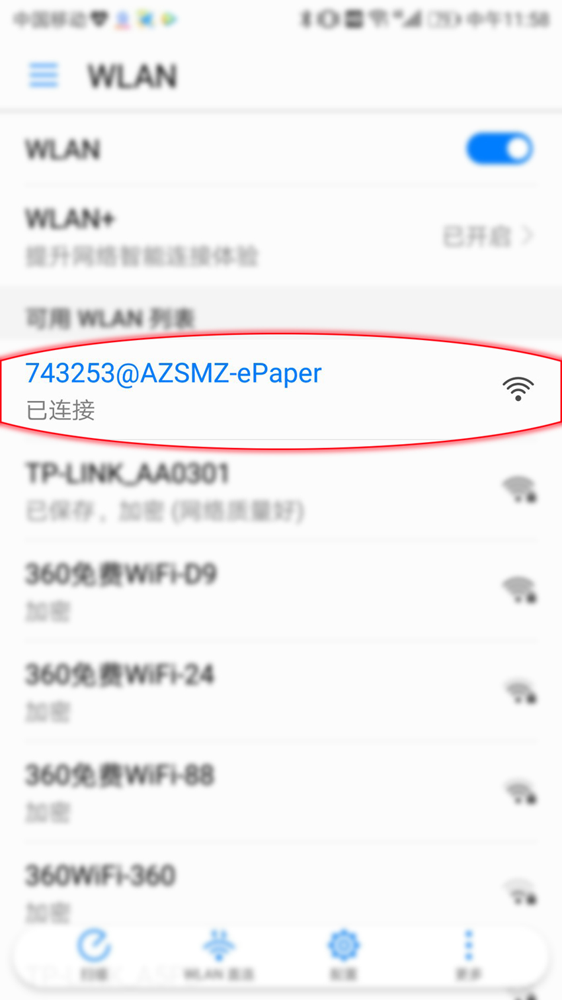
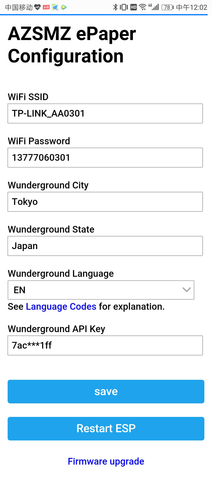

# AZSMZ EPaper 2.9" or AZSMZ EPaper 2.9" Mini

WeatherStation for the AZSMZ EPaper 2.9" or AZSMZ EPaper 2.9" Mini

Please edit setting.h file

if module is AZSMZ EPaper 2.9":    
//#define AZSMZ_EPAPER_MINI   21  

if module is AZSMZ EPaper 2.9" Mini:    
#define AZSMZ_EPAPER_MINI   21  

# where to get
http://azsmz.aliexpress.com

# Install Instructions
https://github.com/cxandy/espaper-weatherstation/wiki/Install-Instructions

# web config Instructions

